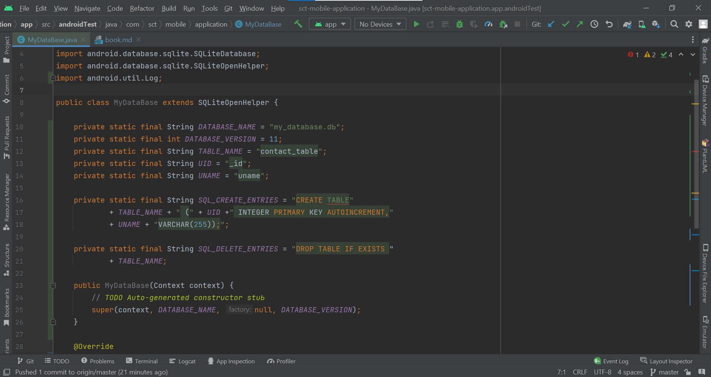
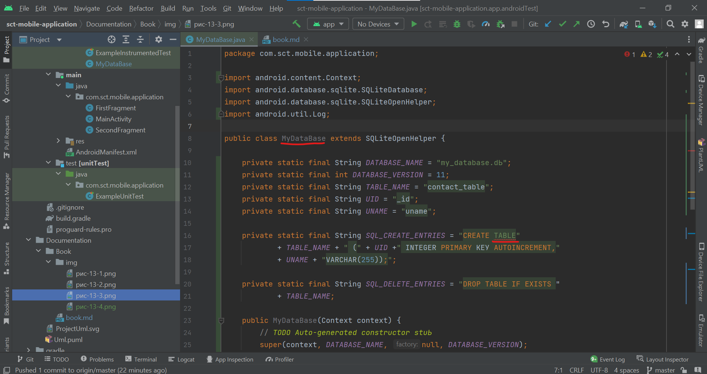

Есть два способа заполучить объект класса weьview. Первый заключ;ается в использовании конструктора класса WebView, второй - в получении этого объекта из разметки приложения (предварительно его нужно поместить в разметку с помощью
визуального редактора разметки):<br/>
```java
// Первый способ
WebView browser = new WebView(this);
// Второй способ
WebView browser = (WebView) findViewByid(R.id.webview);
```
После этого можно загрузить документ:<br/>
browser.loadUrl("http://www.dkws.org.ua/");<br/>
При желании можно загружать НТМL-код из строки:<br/>
String html = "<htrnl><Ьody><hl>Hello</hl></body></htrnl>";<br/>
browser.loadData(html, "text/html", "utf-8");<br/>
д,1я настройки браузера используется класс weьsettings:<br/>
```java
WebSettings webSettings = webView.getSettings();
// Блокируем картинки для экономии трафика
webSettings.setBlockNetworkimage(true);
// Запрещаем сохранять данные форм
webSettings.setSaveFoпnData(false);
// Разрешаем JavaScript
webSettings.setJavaScriptEnaЬled(true);
// Запрещаем сохранять пароли
webSettings.setSavePassword(false);
// Устанавливаем размер шрифта по умолчанию (от 1 до 72)
webSettings.setDefaultFixedFontSize(2);
// Устанавливаем название нашего браузера
webSettings.setUserAgentString("My browser v 1.0");
```
Подробно о методах класса websettings (а значит, и о параметрах браузера) вы можете прочитать в руководстве разработчика Android:<br/>
http://developer.android.com/reference/android/webkit/WebSettings.btml<br/>
Класс WebView тоже описан в руководстве разработчика:<br/>
bttp://developer .android.com/reference/android/webkit/W еЬ View .Ьtml<br/>

# Глава 13
## База данных SQLite
### 13.1. Введение в базы данных для Android 
В этой книге мы познакомились почти со всеми основными способами хранения
данных на Android-ycтpoйcтвe ( см. главу 8). Осталось рассмотреть базы данных
(БД), которые используются для хранения более сложных структур данных.<br/>
Мы не станем здесь изучать основы баз данных и начала языка запросов SQL.
Предполагается, что вы уже с этими темами знакомы. Если это не так, то на полках
книжного магазина, я уверен, вы найдете много книг, способных заполнить этот
пробел в ваших знаниях.<br/>
В ОС Android принята система управления базами данных (СУБД) SQLite. Да, возможности SQLite относительно скромны. Но ведь и такая мощная СУБД, как
Oracle, в мобильном телефоне ни к чему. Зато SQLite- самая быстрая СУБД для
несложных запросов на сегодняшний день.<br/>
На Android-ycтpoйcтвe база данных хранится в каталоге /data/data/<имя пакета>/
dataЬases. С помощью контент-провайдера несколько приложений могут использовать одну и ту же базу данных.<br/>
Основные этапы при работе с базой данных следующие:<br/>
- создание и открытие базы данных;
- создание таблицы;
- создание Insеrt-интерфейса (используется для вставки данных);
- создание Quеrу-интерфейса (используется для выполнения запроса, обычно для
выборки данных);
- закрытие базы данных.
Далее будут продемонстрированы основные приемы при работе с базой данных:
вставка, удаление и выборка записей.<br/>

Если вы раньше работали с РНР и MySQL, то вас здесь не ожидают никакие неожиданности. Для всех остальных читателей постараюсь объяснить все максимально подробно. <br/>
Обратите также внимание : приступая к написанию кода, помните, что уже есть готовый класс SQLiteOpenНelper, который вы можете наследовать, а не «изобретать
колесо)) заново. Ведь в своих проектах мы всегда наследуемся от Activity (extends
Activity). Аналогично нужно поступить и работая с базой данных.<br/>
### 13.2. Подготовка вспомогательного класса
Создайте новый проект как обычно. Пусть он называется android _ d.Ь, а пакету присвойте название вида com.example.<вawe_имя>.android_db- например, com.example.
den.android_db. В качестве шаблона разметки выберите Empty Activity (рис . 13 .1 ). 

<b>Рис. 13.1. Соэдание нового проекта для главы 13</b>

После этого создайте новый класс: File I New I Java Class. В открывшемся диалоговом окне введите название нового класса: MyDataBase (рис. 13 .2).<br/>
Если вы заполнили окно Create New Class, как показано на рис. 13 .2, в области
Project основного окна Aпdroid Studio появится файл MyDataBase.java. Добавьте
в него следующее содержимое (листинг 13 .1 ), как показано на рис. 13 .3.
<br/>
<b>Рис. 13.2. Соэдание нового Jаvа-класса</b>


<b>Рис. 13.3. Код нового Jаvа-класса</b>

<b>Листинг 13.1 Заготовка для класса (файл MyDatabase.java)</b>
```java
package com.sct.mobile.application;

import android.database.sqlite.SQLiteDatabase;
import android.database.sqlite.SQLiteOpenHelper;

public class MyDataBase extends SQLiteOpenHelper {

    @Override
    public void onCreate(SQLiteDatabase arg0) {
    // TODO Auto-generated rnethod stuЬ
    }

    @Override
    public void onUpgrade(SQLiteDatabase arg0, int argl, int arg2) {
    // TODO Auto-generated rnethod stuЬ
    }
}
```
У класса должны быть два обязательных метода: oncreate () и onUpgrade (), о которых мы поговорим чуть позже.<br/>
Обратите внимание: на рис. 13.3 название класса MyDataBase подчеркнуто красной
волнистой линией, а напротив строки объявления класса стоит значок ошибки. Все
в порядке - просто среда требует, чтобы мы создали конструктор класса.<br>
Вот код этого конструктора:<br/>
```java
    private static final String DATABASE_NAME = "my_database.dЬ";
    private static final int DATABASE_VERSION = 1;

    public MyDataBase(Context context) {
        super(context, DATABASE_NAME, null, DATABASE_VERSION);
    }
```
Кроме кода конструктора мы добавили еще несколько вспомогательных констант:
первая константа задает имя файла с базой данных, вторая отвечает за номер базы
данных. Принцип работы номера базы такой же, как и у версии приложения. Если
вы видите, что вьшmа версия приложения 11, а у вас 1 О, то его пора обновить. Аналогично, если программа заметит обновление номера базы данных, она запускает
метод onUpgrade (), который сгенерирован автоматически. В нем нужно разместить
код, который должен вызываться при обновлении базы данных.<br/>
С методом oncreate () проще - в нем создается сама база данных с данными, необходимыми для работы.<br/>
Кроме имени файла базы данных и ее версии надо указать имя таблицы и имена
колонок таблицы. Давайте создадим простую таблицу, которая будет содержать
идентификатор пользователя (uш) и его имя (UNAМE): <br/>
```java
    private static final String UID = " id";
    private static final String UNAME = "uname";
```
Первая констата - это непросто идентификатор. Эго поле с автоматическим инкрементом. Оно будет увеличиваться автоматически при добавлении новой строки
в таблицу.<br/>
В листинге 13.2 приведен полный код нашего вспомогательного класса (рис. 13.4).
Поскольку рассмотрение операторов SQL выходит за рамки этой книги, то без
краткого пояснения все же не обойтись, а остальную информацию ( если вы не знакомы с SQL) можно найти в Интернете. Итак, для создания таблицы используется
оператор CREATE ТАВLЕ. Для уничтожения таблицы - оператор DROP ТАВLЕ. SQL onepaтopы выполняются методом execSQL () . <br/><br/>
<b>Листинг 13.2 Полный код вспомогательного класса</b><br/>
```java
package com.sct.mobile.application;

import android.content.Context;
import android.database.sqlite.SQLiteDatabase;
import android.database.sqlite.SQLiteOpenHelper;
import android.util.Log;

public class MyDataBase extends SQLiteOpenHelper {

    private static final String DATABASE_NAME = "my_database.dЬ";
    private static final int DATABASE_VERSION = 11;
    private static final String TABLE_NAME = "contact_table";
    private static final String UID = "_id";
    private static final String UNAME = "uname";

    private static final String SQL_CREATE_ENTRIES = "CREATE ТАВLЕ"
            + TABLE_NAME + " (" + UID +" INTEGER PRIMARY КЕУ AUTOINCREMENT,"
            + UNAME + "VARCHAR(255));";

    private static final String SQL_DELETE_ENTRIES = "DROP TABLE IF EXISTS "
            + TABLE_NAME;

    public MyDataBase(Context context) {
        // TODO Auto-generated constructor stuЬ
        super(context, DATABASE_NAME, null, DATABASE_VERSION);
    }

    @Override
    public void onCreate(SQLiteDatabase db) {
        // TODO Auto-generated method stub
        db.execSQL(SQL_CREATE_ENTRIES);
    }

    @Override
    public void onUpgrade(SQLiteDatabase db, int oldVersion, int newVersion) {
        // TODO Auto-generated method stub
        Log.w("LOG_TAG", "Upgrading DB version " + oldVersion
        + " to version " + newVersion);
        
        //Удаляем предыдущую таблицу при обновлении
        db.execSQL(SQL_DELETE_ENTRIES);
        onCreate(db);
    }
}
```


<b>Рис. 13.4. Код нового Jаvа-класса</b><br/>


<b>Рис. 13.5. Код нового Jаvа-класса</b>