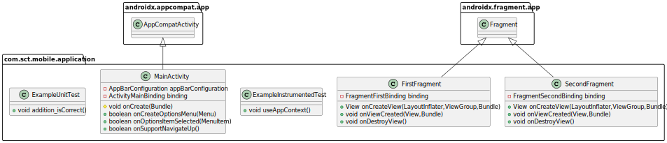

# А.3 Назначение разработки
## А.3.1 Функциональное назначение
Функциональное назначение программного средства заключается в предоставлении услуг по аренде транспортных средств.
## А.3.2 Эксплуатационное назначение
Эксплуатационное назначение состоит в использовании программного средства на компьютере и мобильном телефоне в приложении Telegram.
## A.4 Требования к программе
### А.4.1 Требования к функциональным характеристикам
Сервис должен осуществлять следующий функционал:
1.	Регистрация нового аккаунта;
2.	Аутентификация и авторизация пользователя.
3.  Просмотр истории текущих аренд и истории аренд.
4.  Выбор и аренда транспортного средства с помощью карты.
5.  Завершение аренды.
## А.4.2 Требования к надежности 
Надежное функционирование программы должно быть обеспечено выполнением совокупности нижеописанных мероприятий:
-	выполнение требований ГОСТ 51188-98;
-	защита информации;
-	использованием лицензионного программного обеспечения.
### А.4.2.1 Входные данные
В качестве входных данных являются сведения, внесенные пользователем при регистрации в приложении.
### А.4.2.2 Выходные данные
Выходные данные представляются в формате уведомлений в приложении.

#UML диаграмма проекта
